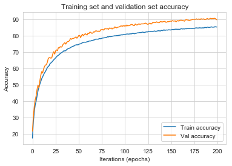
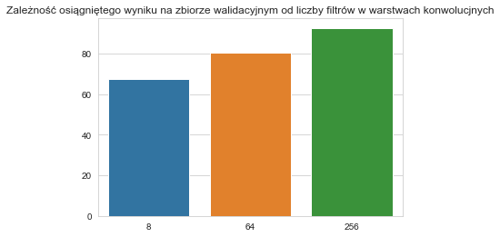
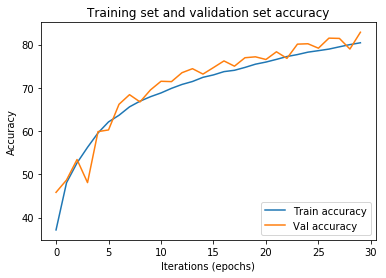
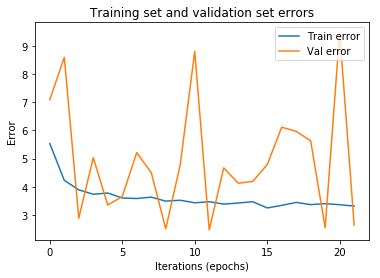
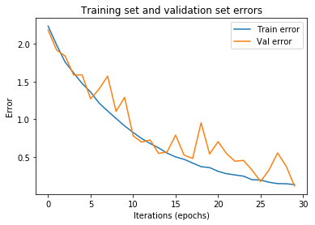

\thispagestyle{empty}
\newpage


## Porównanie wpływu liczby warstw konwolucyjnych na wyniki algorytmu

W poniższej sekcji porównam wpływ liczby warstw konwolucjnych do wyników sieci.
Zbuduję 3 sieci, składającą się z 3 paczek warstw konwolucyjnych gdzie każda paczka składa się z dwóch warstw konwolucyjnych oraz z warstwy MaxPool.

Sprawdźmy ile wag ma każda z sieci.

```
Sieć duża ma 1370474 parametrów
Sieć średnia ma 332970 parametrów
Sieć mała ma 275210 parametrów
```

Po wytrenowaniu sieci stosując metodę wczesnego stopowania po nieosiągnięciu poprawy na zbiorze walidacyjnym przy więcej niż 10 epoków sieci uzyskały następujące wyniki:

{height=30%}


Jak widać sieć o największej liczbie sekwencji warst konwolucjnych ma najwyższe accuracy, jednak jest ono niewiele większe niż accuracy zbioru drugiego. Możemy zatem wnioskować, że dodawanie kolejnych sekwencji konwolucyjnych nie wiele by dało. Warto natomiast zwrócić uwagę na zbieżność każdej z sieci. Porównajmy zatem wykresy accuracy sieci dużej i średniej.


>     brain_big.plot_accuracy()

{height=30%}

>     brain_medium.plot_accuracy()

{height=30%}


Na pierwszym obrazku jest sieć duża, a na drugim średnia. Jak widać sieć duża trochę szybciej zbiega do optymalnego rozwiązania, niż sieć średnia. Może być to związne z tym, że jeśli sieć ma więcej parametrów nie musi ich tak dokładnie optymalizować jak sieć o mniejszej liczbie parametrów.

## Porównanie wpływu liczby filtrów w warstwach konwolucyjnych

W poprzedniej części sprawdzaliśmy jaki wpływ ma dodawanie większej liczby warstw konwolucjnych. W tej zajmiemy się natomiast wielkością każdej warsty czyli liczbą filtrów konwolucyjnych. Poprzednie rozważania możemy nazwać rozszerzaniem sieci wzdłuż, a te rozszerzaniem sieci wszerz.

Podstawową siecią, będzie sieć o dwóch warstw konwolucyjnych, warstwy MaxPool i dwóch warst fully-connected.


{height=30%}


Jak widać sieć o najmniejszej liczbie filtrów posiada dużo mniejsze zdolności nauczenia się danych niż sieć o dużej liczbie filtrów. Sprawdźmy jak wygląda liczba paramtetrów tych sieci.

{height=30%}


Jak widać liczba parametrów rośnie wykładniczo w stosunku do liczby filtrów w warstwach konwolucjnych.

Ciekawym wnioskiem z tego eksperymentu jest porównanie tempa rośnięcia accuracy oraz liczby parametrów. Jak widać accuracy rośnie dość liniowo, natomiast liczba parametrów wykładniczo. Jest to jedna z przeszkód z tworzeniem coraz większych sieci. W pewnym momencie zysk na accuracy jest zbyt mały w stosunku do potrzeb obliczeniowych by nauczyć wielkie sieci.

Dodatkowo w przypadku sieci o dużej liczbie parametrów istnieje możliwość przeuczenia modelu, tak by jego wynik na zbiorze testowym był znacząco niższy niż na zbiorze treningowym. By tego uniknąć stosowaliśmy metodę `dropout` i `BatchNorm` o czym więcej w dalszej części raportu.

## Wpływ learnig rate na proces ucznia modelu.

Najważniejszym paramtrem procesu uczenia jest `learning_rate`. Odpowiada on za za szybkość zmiany wag w podstawowym modelu na podstawie gradientu wag. W poniższej sekcji zbadamy jak wybór tego hiperparametru wpływa na proces uczenia. Wybraliśmy sieć podobną do sieci w poprzednim zadaniu i zbadamy jak zachowuję się proces jej uczenia w zależności od wyboru `learning_rate`.


Porównajmy krzywę uczenia tych trzech modeli z odpowiednio `learning_rate = 0.01, 0.1 i 1`.

{height=30%}


Jak widać sieć z `learnig_rate=1` nie zbiega i zachowuje się bardzo losowo. Jest to za duża wartość tego parametru i nie prowadzi ona do żadnych sensownych wyników. Natomiast porównując `learning_rate=0.1` z `learning_rate=0.01` możemy dojść do wniosków, że o ile większa wartość tego parametru powoduje szybsze uczenie modelu, to jednak model z mniejszą wartością jest w stanie lepiej nauczyć się danych. Jest to spowodowane najpewniej tym, że w końcowych etapach uczenia, musimy bardzo powoli zmieniać parametry by nie przestrzelić optimum.

Patrząc na powyższy wykres można również dojść do wniosku, że najlepiej kilkanaście pierwszych epoków nauczyć na dość dużym `learning_rate` i potem w miarę osiągania przez sieć coraz lepszych wyników go zmniejszać. Jest to praktyka używana w wielu modelach praktycznych, ponieważ znacznie zmniejsza czas uczenia.

## Test obróbki wstępnej danych wejściowych w zbiorze treningowym.

W bibliotece `pytorch` której używamy do budowy sieci konwolucjnych zostało zaprogramowane wiele różnych opcji zmiany obrazków wejściowych w zbiorze treningowym tak by poprawić wyniki sieci. Ważne by przekształcenia stosować tylko do zbioru treningowego, a nie testowego.

Sprawdźmy jak przekształcenia pomagają zwiększyć accuracy modelu. Będziemy posługiwać się największym modelem testowanym w sekcji porównywania liczby filtrów.

Rozważać będziemy przekształcenie `RandomHorizontalFlop` czyli losowe przewrócenie obrazka w pionie, oraz `noise` czyli dodanie szumu losowego do obrazka.


{height=30%}


Jak widać im więcej preprocessingu tym wynik na zbiorze walidacyjnym jest większy. Prawdopodobnie jest tak ponieważ dodając losowe przekształcenia uodporniamy model na więcej sytuacji w zbiorze testowym, sprawiamy, że lepiej genreralizuje problem, oraz dodajemy mu nowe *sztuczne* obserwacje do zbioru treningowego.

\newpage


## Wpływ rodzaju poolingu na skuteczność sieci

Architektura sieci użytej do testów składała się z dwóch sekwencji, gdzie obie sekwencje zawierały następujący zestaw warstw:

```
[Conv -- ReLU -- BatchNorm]x2 -- Pool -- Dropout
```

Testowałem wpływ czterech wariantów poolingu: jego braku, MaxPool, AvgPool i warstwy konwolucyjnej. Każdy wariant (oprócz braku poolingu) zmniejszał o połowę wymiary obrazka. Przetestowałem wszystkie możliwe kombinacje opcji poolingu (po jednym na końcu każdej sekwencji). Każda z tych architektur została uruchomiona na 30 epok.

{height=30%}


Na powyższej mapie ciepła widzimy, że różnice w uśrednionej dokładności nie różnią się zbytnio. Jednakże faworytami są warianty, które po drugiej sekwencji nie miały poolingu. Wydaj się to być zgodne z intuicją, ponieważ nie wykonując poolingu zachowujemy pełen rozmiar danych.

### Wniosek
Dość dobrym podejściem wydaje się niestosowanie poolingu, jeśli możemy sobie pozwolić na to, czyli jeśli zbiór danych nie jest nadmiernie duży i niekoniecznie zależy nam na szybkości sieci.

## Wpływ BatchNorma na wyniki

Do testów w tej części wykorzystałem architekturę, która nie miała żadnego poolingu i warstwę BatchNorm ma w połowie i na końcu każdej z sekwencji (dwie sekwencje, każda z dwóch zestawów: `Conv -- ReLU -- BatchNorm`). Tak więc podstawowe wyniki wyglądają następująco:

| Class                   | Train  | Test  |
|-------------------------|--------|-------|
| airplane   | 79.86% | 80.30%|
|  automobile | 90.24% | 90.32%|
| bird       | 67.14% | 66.98%|
|  cat        | 63.02% | 62.94%|
|  deer       | 80.08% | 80.50%|
|   dog        | 66.54% | 66.38%|
|   frog       | 89.74% | 89.90%|
|  horse      | 85.78% | 85.84%|
|  ship       | 91.98% | 91.64%|
|  truck      | 90.34% | 90.44%|

Z początku spróbowałem zostawić BatchNormy tylko na koniec każdej z sekwencji:

| Class                   | Train  | Test  |
|-------------------------|--------|-------|
| airplane   | 83.92% | 83.76%|
| automobile | 91.62% | 91.26%|
| bird       | 67.98% | 67.58%|
| cat        | 69.46% | 69.86%|
| deer       | 76.86% | 76.76%|
| dog        | 76.32% | 76.18%|
| frog       | 81.56% | 81.60%|
| horse      | 88.16% | 87.88%|
| ship       | 83.86% | 83.72%|
| truck      | 88.24% | 87.96%|

Otrzymane wyniki są dość zbliżone do tych powyższych. Średnia skuteczność nieznacznie wzrosła (ok. 0.5%), jednakże wariancja zmalała o ok. 3.3%. Można zatem powiedzieć, że ograniczenie liczby BatchNormów w tym konkretnym przypadku skutkuje "ustabilizowaniem się" skuteczności sieci.

Idąc tym tropem postanowiłem usunąć kolejną warstwę BatchNorm tak, żeby została tylko jedna na końcu pierwszej sekwencji.


{width=50%} \ {width=50%}


| Class                   | Train  | Test  |
|-------------------------|--------|-------|
    |  airplane   | 70.76% | 70.72%|
    |  automobile | 88.08% | 88.08%|
    |  bird       | 64.22% | 64.14%|
    |  cat        | 59.32% | 58.82%|
    |  deer       | 66.72% | 66.54%|
    |  dog        | 49.02% | 49.20%|
    |  frog       | 82.06% | 81.54%|
    |  horse      | 77.86% | 77.66%|
    |  ship       | 86.16% | 86.18%|
    |  truck      | 85.24% | 84.84%|
    

Ten eksperyment nie przyniósł pozytywnego rezultatu dla skuteczności sieci. Średnia wartość dokładności predykcji spadła aż o 8%, a niektóre kategorie były klasyfikowane ze skutecznością mniejszą o ponad 15%. Patrząc na wykres błędu momentalnie rzuca się oscylacja błędu z dość dużą amplitudą.

Kolejną próbę podjąłem pozostawiając jedną sekwencję tak jak w wyjściowej architekturze, to jest dwa BatchNormy, a drugą pozbawiłem warst BatchNormowych. Efekt podobnie jak powyżej nie był zadowalający, ponieważ skuteczność predykcji zmalała, co przedstawia poniższa tabela:

| Class                   | Train  | Test  |
|-------------------------|--------|-------|
|  airplane   | 81.58% | 81.70%|
|  automobile | 82.62% | 83.08%|
|  bird       | 67.02% | 66.96%|
|  cat        | 36.74% | 37.32%|
|  deer       | 52.08% | 51.98%|
|  dog        | 69.80% | 70.10%|
|  frog       | 85.84% | 86.20%|
|  horse      | 66.96% | 66.32%|
|  ship       | 82.62% | 82.60%|
|  truck      | 87.36% | 87.26%|

Ostatnią próbą było odwrócenie poprzedniego przypadku, to jest dwa BatchNormy w drugiej sekwencji i brak w pierwszej. Efekt okazał się lepszy niż poprzednio o średnio 5% na skuteczności predykcji klas zbioru testowego.

### Wniosek

Największą skutecznością odznaczyła się struktura sieci, która tylko raz na sekwencję (czyli `[Conv -- Relu]x2 -- Batch`) występuje warstwa normująca. Jendakże nadmierna redukcja liczby warstw normujących miała złe skutki na możliwościach klasyfikacyjnych sieci.

## Wpływ Dropoutu na wyniki

Tutaj punktem wyjściowym była taka sama struktura jak w poprzedniej części. Swoje testy rozpocząłem od usunięcia Dropoutu z obu sekwencji. Oryginalnie był to Dropout z parametrami, odpowiednio, 0.2 i 0.3 dla pierwszej i drugiej sekwencji.


{width=50%} \ {width=50%}


| Class                   | Train  | Test  |
|-------------------------|--------|-------|
    | airplane   | 91.86% | 91.56%|
    |  automobile | 93.56% | 93.72%|
    |  bird       | 81.22% | 80.98%|
    |  cat        | 81.40% | 81.14%|
    |deer       | 87.68% | 88.06%|
    | dog        | 86.60% | 86.50%|
    | frog       | 91.50% | 91.70%|
    |  horse      | 92.02% | 91.92%|
    |  ship       | 93.66% | 93.84%|
    |  truck      | 94.94% | 95.06%|
    

Wyniki są takie jakich byśmy oczekiwali. Sieć ma teraz ułatwione uczenie się ze względu na to, że cały czas ma do dyspozycji wszystkie neurony. Jednakże skutkować to będzie w przeuczeniu się sieci lub kładzeniu ogromnej wagi na tylko parę jednostek.

W kolejnym etapie testowania dodałem dość duży Dropout (równy 0.5) na końcu pierwszej sekwencji, gdzie wyjściowa architektura miała Dropout 0.2 dla pierwszej sekwencji i 0.3 dla drugiej sekwencji. 


{width=50%} \ {width=50%}

| Class                   | Train  | Test  |
|-------------------------|--------|-------|
    | airplane   | 86.34% | 86.40%|
    | automobile | 92.22% | 92.24%|
    |  bird       | 71.44% | 71.64%|
    |  cat        | 70.90% | 71.60%|
    | deer       | 81.16% | 81.08%|
    | dog        | 77.14% | 77.08%|
    |  frog       | 81.22% | 81.68%|
    | horse      | 86.90% | 86.76%|
    |  ship       | 91.44% | 91.32%|
    |  truck      | 88.68% | 88.56%|
 

Ten wariant uzyskał nieco lepsze wyniki (uśrednione 2% skuteczności i wariancja pomniejszona o 4%) niż wyjściowa architektura.

Poniższy wykres pokazuje nam zależność między skutecznością (wielkość kropek), a wartościami współczynnika Dropout na końcach poszczególnych sekwencji. Widoczny jest trend taki, że im mniejszy dropout tym skuteczniejsza sieć. Jednakże wydaje się to być efektem przeuczenia sieci do danego zbioru.


{height=30%}

### Wniosek
Wydawać by się mogło, że brak DropOutu jest najlepszą opcją. To błędne przekonanie najpewniej wynika stąd, że w przypadku testowania tylko na jednym zbiorze nie dostrzegamy potrzeby generalizacji modelu, a właśnie za generalizację modelu odpowiada odpowiednio dobrany DropOut. Dlatego zbadanie wpływu tego parametru wymagałoby dodatkowych testów.

\newpage

## Wykorzystanie gotowych architektur sieci neuronowych

Dla każdej gotowej architektury pokażemy jak zbiegają błędy i accuracy. Wykorzystamy sieci które są już wytrenowane jak również będziemy trenować je od zera.

W niektórych przypadkach wykresy mogą być niekompletne, spowodowane jest to niezapisaniem przez nas modeli i brakiem czasu na kolejne testowanie. Jednak wyniki zbiorcze przedstawione są na końcu tej części raportu.

Poniżej tabelka zawierająca przybliżone liczby parametrów potrzebnych do nauczenia w danej architekturze. Warto porównać te liczby ze skutecznością sieci i zobaczyć że nie zawsze ilość znaczy jakość.

| Rok powstania | Architektura | Ilość parametrów do nauczenia|
|---------------|--------------|------------------------------|
|2012| AlexNet | 60 milionów |
|2014| VGG16 | 138 milionów |
|2014| GoogleNet | 4 miliony |
|2015| ResNet152 | 12 milionów |
|2016| DenseNet121 | 5 milionów |


### AlexNet

Tą część zaczniemy od sieci która powstała w $2012$, a stworzył ją **Alex Krizhevsky**.
W architekturze możemy zauważyć pewne elementy występujące w sieciach do dzisiaj, ale jednak w 2012 były nowością:

- wykorzystanie ReLU
- wykorzystanie metody Dropout do "wyłączania" losowych neuronów aby uniknąć overfittingu

**AlexNet** zawiera w sumie **5 warstw konwolucyjnych**, opowiedno z liczbą filtrów (64, 192, 384, 256, 256) o rozmiarach (11, 5, 3, 3, 3). Każda warstwa konwolucyjna jest zakończończona aktywacją **ReLU**, a dodatkowo po 1, 2 i 5 warstwie występuje **MaxPooling** zmiejszający rozmiar wstępnej macierzy ok. 2 razy. Na samym końcu, po linearyzacji, występują 3 warstwy liniowe, pomiędzy którymi występuje **Dropout** z poziomem $0.5$. Dosyć ciekawym rozwiązaniem jest wykorzystanie Dropoutu dopiero w końcowych warstwach

#### Pretrained AlexNet \newline

{width=50%} \ {width=50%}

\newpage

| Class                   | Train  | Test  |
|-------------------------|--------|-------|
|              airplane   | 78.22% | 78.24%|
|              automobile | 93.78% | 93.70%|
|              bird       | 68.04% | 67.38%|
|              cat        |  6.34% |  6.76%|
|              deer       | 64.78% | 65.50%|
|              dog        | 95.96% | 95.80%|
|              frog       | 84.30% | 84.28%|
|              horse      | 74.66% | 74.52%|
|              ship       | 90.42% | 90.26%|
|              truck      | 71.12% | 70.96%|


#### AlexNet from the beginning \newline

{width=50%} \ {width=50%}


| Class                   | Train  | Test  |
|-------------------------|--------|-------|
| airplane                | 96.94% | 96.92%|
| automobile              | 97.16% | 97.34%|
| bird                    | 98.30% | 98.20%|
| cat                     | 97.12% | 97.36%|
| deer                    | 92.68% | 92.68%|
| dog                     | 92.78% | 92.16%|
| frog                    | 95.68% | 95.68%|
| horse                   | 92.94% | 92.82%|
| ship                    | 96.04% | 96.06%|
| truck                   | 94.42% | 94.50%|

\newpage

### VGG
Powstała w $2014$ na uniwersytecie w Oxfordzie, podstawowa różnica między poprzednikami to **wykorzystanie dużej ilości filtrów małego rozmiaru**. Np. zamiast korzystać z 3 filtrów o rozmiarze 512x512, wykorzystywano 512 filtrów o rozmiarze 3x3, co daje bardzo podobny rezultat.
Z powodu ogromnej ilości filtrów w aż **16 warstwach konwolucyjnych** sieć wymaga ogromnej mocy obliczeniowej. Do przykładowego konkursu w którym sieć zdobyła pierwsze miejsce w 2014, była trenowana ok 2-3 tygodni na 4 najnowszych kartach graficznych.

#### Pretrained VGG16 \newline

{width=50%} \ {width=50%}


| Class                   | Train  | Test  |
|-------------------------|--------|-------|
|              airplane   | 21.72% | 21.74%|
|              automobile | 64.20% | 63.68%|
| bird       | 58.52% | 58.80%|
|  cat        | 34.84% | 34.52%|
| deer       | 63.46% | 63.16%|
|  dog        | 70.38% | 70.46%|
|  frog       | 43.38% | 44.46%|
|  horse      | 72.04% | 72.40%|
|  ship       | 79.88% | 80.20%|
| truck      | 73.64% | 73.80%|


#### VGG16 from the beginning \newline

{width=50%} \ {width=50%}


| Class                   | Train  | Test  |
|-------------------------|--------|-------|
|              airplane   | 98.62% | 98.62%|
|              automobile | 98.88% | 98.82%|
|              bird       | 95.40% | 95.26%|
|              cat        | 97.02% | 96.88%|
|              deer       | 98.80% | 98.70%|
|              dog        | 89.98% | 90.24%|
|              frog       | 95.18% | 95.20%|
|              horse      | 90.44% | 90.24%|
|              ship       | 98.34% | 98.16%|
|              truck      | 97.68% | 98.06%|


### GoogleNet

Po sukcesie sieci **VGG** zaczęto zastanwiać się co zrobić, aby zachować skuteczność sieci, ale zmniejszyć ilość parametrów potrzebnych do wyuczenia. Christian Szegedy z Google wpadł na 2 pomysły:
- Wykorzystanie metody typu **Bottleneck** (w połączeniu z równoległym uczeniem) (**Inception Layer**)
- Zrezygnowanie z całkowicie połączonych warstw i zastąpienie ich inną metodą pozwalającą przekształcić mapy aktywacji na klasyfikacje **AvgPooling**

Metoda **Inception** polega na rozdzieleniu warstwy na kilka mniejszych uczonych w tym samym czasie, dodatkowo każda z mniejszych warstw ma inne rozmiary filtrów, a nawet typów warstw. Na sam koniec warstwy są składane w jeden output. Sama metoda **Inception** nie zmniejsza jednak liczby parametrów do nauczenia.


<hr>

Metoda **Bottleneck** polega na zmniejszeniu ilości parametrów w danych warstwach. Jest to rozszerzenie metody **Network in Network**, polegającej na wykorzystaniu konwolucji o rozmiarze $1x1$ do zredukowania liczby filtrów w mapie (obrazku) na których chcemy wykonać kolejną konwolucję. Dodatkowo metoda **Network in Network** pozwala na wykorzystanie nieliniowej aproksymacji przy detekcji kształtów. Podstawowa konwolucja zakłada, że ukryte pojęcia są liniowo rozdzielalne. Ale linia prosta może nie zawsze pasować. Dlatego wykorzystanie tej metody jest dosyć popularne w dzisiejszych architekturach.

*Przykład:*
Wyobraźmy sobie że do warstwy konwolucyjnej wchodzą dane o głębokości 256 map aktywacji i tyle samo warstw chcemy uzyskać na wyjściu po przetworzeniu ich filtrami konwolucyjnymi o wymiarze $3x3$. Wychodzi na to, że musielibyśmy wykonać $256*256*3*3$~$590k$ operacji.
Teraz zamiast od razu wykonywać operację konwolucji $3x3$, wykonajmy zmniejszenie ilości wejściowych warstw o np. 4 razy, czyli do liczby 64 warstw:
- Zmniejszenie ilości warstw (konwolucja $1x1$): $256*64*1*1$~$16k$
- Prawidłowa warstwa (konwolucja $3x3$): $64*64*3*3$~$36k$
- Zwiększenie ilości warstw (konwolucja $1x1$): $64*256*1*1$~$16k$

Co w sumie daje nam ok. $70k$ operacji do wykonania. To prawie 10 razy mniej niż mielibyśmy wczesniej.

Powodem sukcesu jest to, że wejściowe mapy aktywacji są skorelowane, a zatem można pozbyć się redundancji w danych. Następnie po nałożeniu odpowiedniego filtra, mapy aktywacji można ponownie rozwinąć w sensowną kombinację dla następnej warstwy.

Dzięki temu  wykonanie metody incepcji będzie o wiele mniej kosztowne obliczeniowo.

Na obrazku poniżej widzimy przykładowy segment z sieci GoogleNet.

{width="450"}

<hr>

Metoda **Global Average Pooling** pozwala na zmniejszenie ilości parametrów w ostatniej warstwie sieci, kiedy zamieniamy mapy aktywacji na 1 wymiarową warstę (*fully connected layer*). Dzięki zmniejszeniu liczby parametrów zmiejszamy szansę na overfitting, jak również zmniejszamy wymagania obliczeniowe. Na obrazku poniżej schemat działania **Global Average Poolingu**:

{width="450"}


Niestety w aktualnej wersji Pytorcha nie ma zaimplementowanej oryginalnej sieci GoogleNet, więc posłużymy się jej ulepszoną wersją czyli **Inception_v3**.

#### Pretrainged Inception_v3 (GoogleNet) \newline


{width=50%} \ {width=50%}

\newpage

| Class                   | Train  | Test  |
|-------------------------|--------|-------|
|              airplane   | 78.70% | 78.74%|
|              automobile | 96.16% | 96.56%|
|              bird       | 60.06% | 59.72%|
|              cat        | 47.62% | 47.92%|
|              deer       | 50.78% | 51.32%|
|              dog        | 83.74% | 83.90%|
|              frog       | 90.70% | 91.02%|
|              horse      | 48.48% | 48.06%|
|              ship       | 73.78% | 73.76%|
|              truck      | 75.80% | 76.04%|


### ResNet

Jeżeli osiągneliśmy już wysoką skuteczność i mniejszą złożoność obliczeniową jak w przypadku GoogleNet, to czemu nie stworzyć podobnej architektury tylko że z odpowiednio większą liczbą warstw? Otóż okazuje się, że nie rozwiązuje to problemu. W pewnym momencie sieć przestaje polepszać swoje wyniki.

{width="600"}

Na powyższym obrazku widać, że na przykładowym zbiorze danych sieć o 56 warstwach dostarcza gorsze wyniki, niż ta o warstwach 20. Teoretycznie mogłoby być to spowodowane overfittingiem głębszej sieci, ale wtedy chociaż błąd zbioru treningowego powinien spaść poniżej poziomu sieci dla 20 warstw.

Okazuje się że problemem jest **zanikający gradient**. W końcu im głębszą mamy sieć tym więcej obliczeń wstecz musimy wykonać aby dokonać nauczenia parametrów podczas algorytmu propagacji wstecznej. Jeżeli sieć jest bardzo głęboka i pomnożymy wiele elementów, które są mniejsze niż 1, wynik końcowy będzie bardzo mały. Gdy zbliżamy się do początkowych warstw w głębokiej architekturze, gradient ma już bardzo niską wartość, w niektórych przypadkach jest nawet zerowy, co oznacza, że w ogóle nie aktualizaujemy wcześniejszych parametrów.

Jak sobie z tym poradzić? Na to pytanie odpowiedź znalazło kilka osób z firmy Microsoft. Architektura sieci **ResNet** polega na złożeniu widocznych poniżej bloczków:

{width="200"}

Dzięki dodaniu do wyniku macierzy jednostkowiej, gradient zostaje zachowany i nie ma możliwości aby zbliżył się do $0$. Dzięki temu rozwiązaniu nawet w przypadku bardzo głębokiej sieci, wagi są aktualizowane w początkowych warstwach na podstawie zachowanego gradientu.

#### Pretrained ResNet \newline

{width=50%} \ {width=50%}


| Class                   | Train  | Test  |
|-------------------------|--------|-------|
|              airplane   | 63.32% | 62.74%|
|              automobile |  5.04% |  5.10%|
|              bird       | 39.74% | 39.48%|
|              cat        | 77.42% | 77.46%|
|              deer       | 50.74% | 50.88%|
|              dog        |  6.50% |  6.88%|
|              frog       | 48.16% | 47.60%|
|              horse      | 62.32% | 61.66%|
|              ship       | 60.14% | 59.34%|
|              truck      | 76.22% | 75.42%|


#### ResNet from the beggining \newline

{width=50%} \ {width=50%}


| Class                   | Train  | Test  |
|-------------------------|--------|-------|
|              airplane   | 92.08% | 92.20%|
|              automobile | 63.42% | 63.82%|
|              bird       | 55.04% | 54.70%|
|              cat        | 39.32% | 38.72%|
|              deer       | 17.48% | 16.66%|
|              dog        | 59.12% | 58.92%|
|              frog       | 52.98% | 53.26%|
|              horse      | 51.84% | 52.16%|
|              ship       | 54.40% | 54.62%|
|              truck      | 79.46% | 79.48%|


### DenseNet

Najnowsza architektura w tym zestawieniu pochodzi z Facebook AI Research (FAIR) i zdobyła najlepszą pracę na najbardziej prestiżowej konferencji poświęconej wizji komputerowej w 2017 roku. Podobnie jak wcześniej GoogLeNet i ResNet, DenseNet wprowadził nowy blok zwany **Dense Block**.

**Dense Block** posuwają koncepcję ResNet o krok dalej i do aktualnej warstwy podłączją wszystkie poprzednie! Aby warstwy były ze sobą kompatybilne, stosujemy różne operacje znane z poprzednich architektur. Zaletą tego podejścia jest to że wykorzystujemy parametry po kilka razy i eliminujemy problem znikającego gradientu.

{width="600"}


#### Pretrained DenseNet \newline

{width=50%} \ {width=50%}


| Class                   | Train  | Test  |
|-------------------------|--------|-------|
|              airplane   | 41.36% | 42.02%|
|              automobile | 66.20% | 66.76%|
|              bird       |  0.96% |  0.76%|
|              cat        | 10.84% |  9.96%|
|              deer       | 34.10% | 33.88%|
|              dog        | 67.42% | 67.80%|
|              frog       | 87.18% | 87.00%|
|              horse      | 59.88% | 59.44%|
|              ship       | 75.92% | 75.78%|
|              truck      | 60.26% | 59.68%|


#### DenseNet from the beggining \newline

{width=50%} \ {width=50%}


| Class                   | Train  | Test  |
|-------------------------|--------|-------|
|              airplane   | 94.28% | 94.18%|
|              automobile | 94.12% | 94.44%|
|              bird       | 88.80% | 88.26%|
|              cat        | 81.50% | 81.54%|
|              deer       | 71.64% | 71.42%|
|              dog        | 88.38% | 88.52%|
|              frog       | 88.30% | 88.18%|
|              horse      | 94.06% | 93.82%|
|              ship       | 94.00% | 94.50%|
|              truck      | 78.54% | 78.18%|


### Wnioski:


Testowanie różnych gotowych sieci, które na przestrzeni lat wygrywały konkursy na klasyfikację zdjęć ImageNet daje oczekiwane rezultaty. Im architektura jest nowsza i bardziej zaawansowana - daje lepsze rezultaty. Poniżej wklejamy tabelkę z wynikami accuracy dla poszczególnych sieci.

{width="600"}

**Oprócz tego kilka obserwacji, które warto zanotować na przyszłość:**

- Wymiar i rodzaj danych wejściowych może mieć duże znaczenie dla skuteczności modeli w których korzystamy z już wyuczonych wag.
- ResNet prawdopodobnie wymaga nauki na większej liczbie epok, spowodowane to jest głębokością tej architektury
- Najlepsze wyniki daje DenseNet, ponieważ jest to najbardziej zaawansowana architektura.
